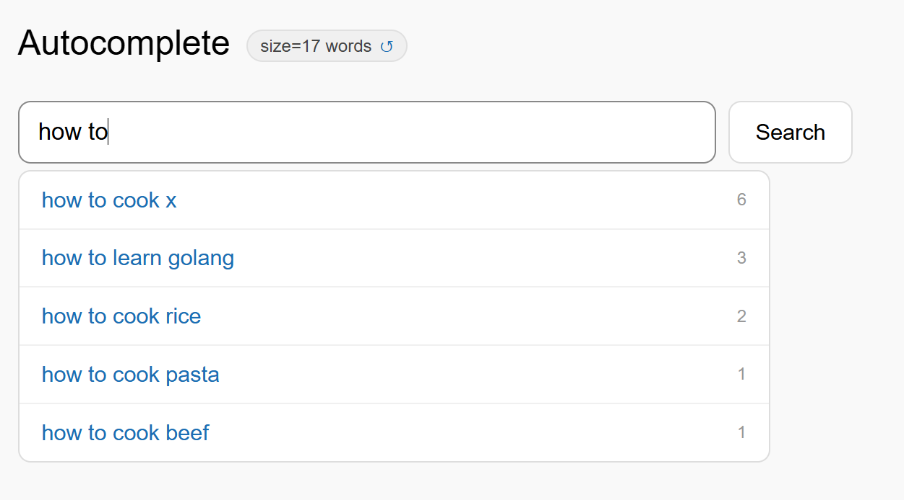
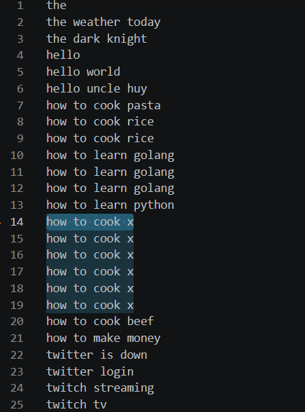
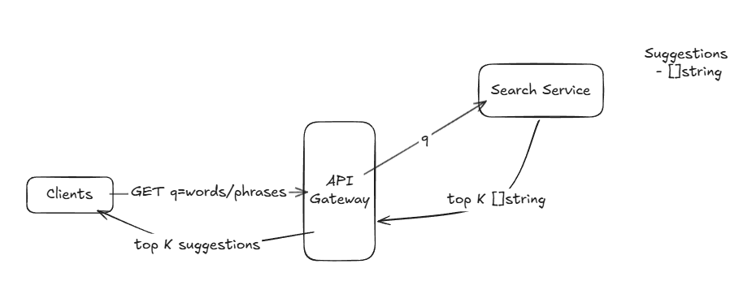
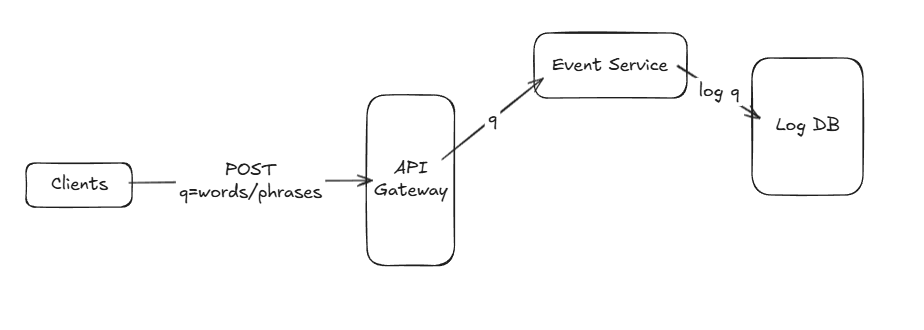
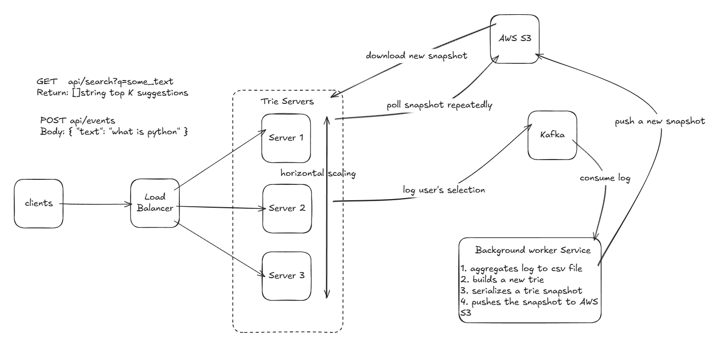

# Search Autocomplete System Design

## Overview
Design a search autocomplete (typeahead) system that serves top K suggestions as users type, supporting 100M DAU and 50,000 QPS at peak.

> Autocomplete is also commonly known as predictive search, type-ahead, or auto-suggest, provides real-time suggestions to users as they type in search boxes. The system must efficiently return top-k relevant and popular suggestions based on historical query data for each prefix input.

<div style="margin-left:3rem">
    
    
</div>

---

## 1. Requirements

### Functional Requirements
1. Users should be able to query **top K suggestions** based on a typed prefix (K is configurable, default K=5)
2. The system should **update the popularity** of words/phrases based on actual user search clicks

### Non-Functional Requirements
1. **Low latency** — suggestions must appear in < 100ms
2. **Scalability** — support 100M DAU with peak traffic of 50,000 QPS
3. **High availability** — system should be highly available, prioritizing availability over consistency
4. **Content moderation** — system should support removal of harmful words/phrases
5. **Stale data is acceptable** — suggestions can be up to 24 hours old (batch updates)

### Capacity Estimation
- 100M DAU × 10 searches/day = ~1,150 QPS average
- ~4-5x peak multiplier → **~50,000 QPS peak** 

---

## 2. Core Entities

| Entity | Fields |
|--------|--------|
| **Suggestions** | `phrase` (string), `frequency` (int) |

---

## 3. API Design

### Read — Get top K suggestions
```
GET /api/search?q={prefix}
Response: string[]   // top 5 suggestions
```

### Write — Log a user selection
```
POST /api/suggestions
Body: { "text": "some text" }
```
> Called when a user actually **clicks** a suggestion, not on every keystroke.

---

## 4. Data Flow[Optional] + High Level Design

### A. Data Flow

#### i. READ flow

- Clients search → Server finds top K suggestions → Return top K suggestions

<div style="margin-left:3rem">
    
</div>


#### ii. WRITE flow
- Clients select a suggestion → Server logs the selection to a log DB

<div style="margin-left:3rem">
    
</div>

---

## 5. Key Components

### Trie Data Structure
- Stored **in-memory** on trie servers for fast prefix lookups
- Each node **precomputes and caches the top 5 suggestions** at that node
  - Eliminates need for DFS(Depth-first Search) + sort(to get top K) on every request
  - Tradeoff: higher memory usage (~1.6GB for 13M nodes)
- Lookups are O(prefix length) — extremely fast

### Horizontal Scaling of Trie Servers
- Multiple trie servers sit behind a **load balancer**
- All servers hold identical trie data
- New versions of the trie are distributed via S3 polling (see Trie Rebuild below)

### Kafka (Write Buffer)
- Every user selection event is published to **Kafka**
- Kafka persists messages to disk across multiple brokers
- Provides both **fault tolerance** and **durability** for the write pipeline
- Decouples high-volume write traffic from the aggregation pipeline

### Background worker service (rebuild a new Trie)
- Runs **periodically (daily or weekly)** 
- Read events log from Kafka broker disk
- Aggregates word/phrase frequencies into CSV dataset
- Re-builds a new trie and serializes snapshot
- Pushes the trie snapshot to AWS S3

### Trie Distribution via S3
- S3 acts as centralized, durable storage for trie snapshots
- Each trie server runs a **background polling thread**
- Rebuild stage: On detecting a new snapshot → downloads → deserializes → performs **double-buffer swap**
- **Note:** Memory usage of a trie server temporarily increase double during **Rebuild stage**

### Double Buffer Swap
- Each trie server normally maintains **one active trie** in memory
- When a new snapshot is detected on S3, a background worker builds a **new trie** alongside the active one

---

## 6. Deep Dives

### Trie Update Pipeline — Two Approaches

**Approach 1: Background job serializes full trie → S3**
- A seperate machine does all the heavy computation (aggregate + build + serialize)
- Trie servers only deserialize and swap
- Pro: Less CPU load and memory usage on production trie servers

**Approach 2: Background job outputs key-value (phrase: frequency) → S3**
- Trie servers download key-value data and build trie themselves
- Pro: Smaller S3 payload, trie build logic stays in one place
- Con: Each of N trie servers builds the trie independently — N times the CPU cost

**I implmented Approach 1**

### Handling Harmful Words (in progress)
- Maintains a **blocklist** of harmful words/phrases
- During trie build, any phrase matching the blocklist is **skipped**
- Future improvement: integrate an **ML classifier** to automatically flag harmful content before it enters the pipeline

### New Words
- Brand new words (e.g. a trending topic) are automatically handled by the pipeline:
  - User searches it → logged to Kafka → aggregated in next batch run → added to trie
  - Tradeoff: new words won't appear as suggestions until next rebuild (accepted)

### Client-Side Optimization — Debouncing
- Client waits **300-500ms** after the user stops typing before sending a request
- Prevents a request on every single keystroke
- Reduces effective QPS significantly (potentially 50-70% reduction)

### Fault Tolerance
- **Trie servers go down?** → Load balancer routes to healthy servers; new servers spin up and pull latest snapshot from S3
- **Kafka broker goes down?** → Kafka replicates across multiple brokers; no data loss
- **Batch job fails?** → Trie servers continue serving the previous snapshot from memory; stale but functional
- **Overall** -> servers remain highly available, data is backed up in a trusted storage system (S3) for recovery

---

## 7. Architecture Summary

<div style="margin-left:3rem">
    
</div>

---

# Resrouces
[AOL Dataset i use(the dataset includes sensitive words/phrases)][https://www.kaggle.com/datasets/dineshydv/aol-user-session-collection-500k/suggestions]

---
