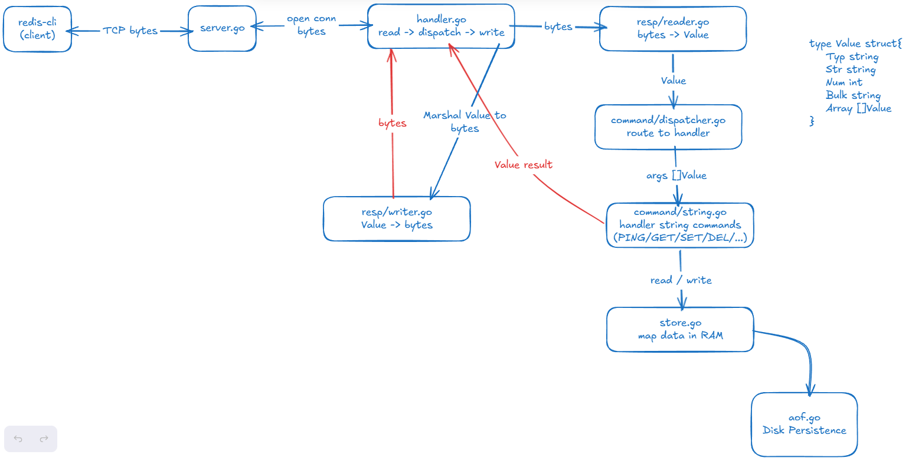

# redis-clone

A Redis-compatible in-memory storage server built from scratch in Go.

> Built as part of my [System Design Series](#) to understand how Redis works under the hood.

---

## Why I Built This

Redis is one of the most widely used tools in system design — caching, pub/sub, leaderboards — but it's often treated as a black box. This project is my attempt to open that box: implement the wire protocol, the storage layer, persistence, expiry and LRU eviction policy from scratch, and understand every tradeoff along the way.

---

## Key Features
 
- **RESP protocol** — parses and serializes Redis wire protocol.
- **Concurrent connections** — goroutine per client with mutex-protected shared storage.
- **In-memory store** — `RWMutex`-backed key-value and hash storage for safe concurrent access.
- **TTL expiry** — expired keys are automatically cleaned up by implementing background goroutine.
- **LRU eviction policy** — evicts Least Recently Used keys when memory exceeds configured capacity, preventing OOM(Out-of-memory) crashes.
- **AOF persistence** — write commands are saved to disk and replayed on restart, safely restoring data if the server crashes.
- **Command dispatcher** — route command names to correct handlers using hash-map.

---

## Request Flow

<!-- Add your workflow diagram here -->


**On restart:** AOF replays every write(SET/DELETE) command top-to-bottom to rebuild RAM state.

---

## Project Structure

```
redis/
├── main.go
├── server/
│   ├── server.go       # TCP listener, accept loop, goroutine per connection
│   └── handler.go      # Reads command → dispatches → writes response
├── resp/
│   ├── types.go        # Value struct and RESP type constants
│   ├── reader.go       # Parses RESP protocol bytes into Value
│   └── writer.go       # Marshals Value back into RESP bytes
├── store/
    ├── lru.go          # Least Recently Used Policy
│   ├── store.go        # In-memory key-value map with RWMutex
│   └── ttl.go          # Expiry tracking and background cleanup
├── command/
│   ├── dispatcher.go   # Maps command names to handler functions
│   ├── hash.go         # HSET, HGET, HDEL, HGETALL, HLEN, HEXISTS
│   ├── string.go       # SET, GET, DEL, PING
│   └── ttl.go          # EXPIRE, TTL
└── persistence/
    └── aof.go          # Append-only file: write on SET/DEL/HSET/HDEL, replay on start
```

---

## RESP Protocol

Redis clients communicate using **RESP (Redis Serialization Protocol)** — a plain-text, line-based protocol over TCP.

| Type    | Prefix | Example |
|---------|--------|---------|
| Simple string | `+` | `+OK\r\n` |
| Error   | `-`    | `-ERR unknown command\r\n` |
| Integer | `:`    | `:42\r\n` |
| Bulk string | `$` | `$3\r\nfoo\r\n` |
| Array   | `*`    | `*2\r\n$3\r\nGET\r\n$3\r\nfoo\r\n` |
| Null    | `$-1`  | `$-1\r\n` |

When you type `GET foo` in redis-cli, it actually sends:
```
*2\r\n$3\r\nGET\r\n$3\r\nfoo\r\n
```

This server parses that wire format, executes the command, and responds in the same protocol.

---

## Supported Commands

| Command | Usage | Description |
|---------|-------|-------------|
| `PING` | `PING [message]` | Returns PONG or echoes message |
| `SET` | `SET key value` | Store a string value |
| `GET` | `GET key` | Retrieve a value, nil if missing |
| `DEL` | `DEL key` | Delete a key |
| `HSET` | `HSET hash field value` | Set a field in a hash |
| `HGET` | `HGET hash field` | Get a field from a hash |
| `HGETALL` | `HGETALL key` | Get all fields and values from a hash |
| `EXPIRE` | `EXPIRE key seconds` | Set a TTL on a key |
| `TTL` | `TTL key` | Get remaining TTL (-1 = key exists, but no expiry set, -2 = key doesn't exists) |

---

## How to Run

**Prerequisites:** Go 1.21+

```bash
# Clone the repo
git clone https://github.com/yourname/redis-clone
cd redis-clone

# Initialize module (first time only)
go mod init github.com/yourname/redis-clone

# Run the server
go run main.go
# → Listening on :6379
```

**Test with redis-cli:**
```bash
redis-cli set foo bar     # OK
redis-cli get foo         # bar
redis-cli expire foo 10   # 1
redis-cli ttl foo         # 9
redis-cli hset user name huy  # OK
redis-cli hget user name      # huy
```

**Test with netcat (no redis-cli needed):**
```bash
echo -e "*1\r\n\$4\r\nPING\r\n" | nc localhost 6379
# → +PONG
```

**AOF persistence:**

Write commands are automatically appended to `database.aof`. On restart, the file replays to restore state:
```bash
redis-cli set foo bar
# stop and restart the server
redis-cli get foo   # still returns bar
```

---

## Concurrency Model

- One goroutine per client connection — no blocking between clients
- `sync.RWMutex` on the store — concurrent reads, exclusive writes
- Separate background goroutines for TTL cleanup and AOF sync

```
acceptLoop
  ├── goroutine → client 1 (handleConn loop)
  ├── goroutine → client 2 (handleConn loop)
  └── goroutine → client 3 (handleConn loop)

store (shared, mutex-protected)
  └── goroutine → TTL cleanup every 1s

aof
  └── goroutine → fsync every 1s
```

---

## What I Learned

- How RESP wire protocol works at the byte level
- Why Redis uses `RWMutex` instead of `Mutex` (concurrent reads don't block each other)
- How TTL, and LRU work behind the scene
- How AOF persistence works — write to RAM first, then disk, replay on restart
- The tradeoff between `appendfsync always` vs `everysec` vs `no`
- ...
---

## What's Next

- [ ] `SETEX`, `PERSIST`, `EXISTS`, `KEYS`
- [ ] List commands: `LPUSH`, `LPOP`, `LRANGE`
- [ ] Pub/Sub

---

## Related
- [Redis Commands](https://redis.io/docs/latest/commands/)
- [Redis Protocol Spec](https://redis.io/docs/latest/develop/reference/protocol-spec/)
- [Build Your Own Redis — CodeCrafters](https://www.build-redis-from-scratch.dev/en/aof)
