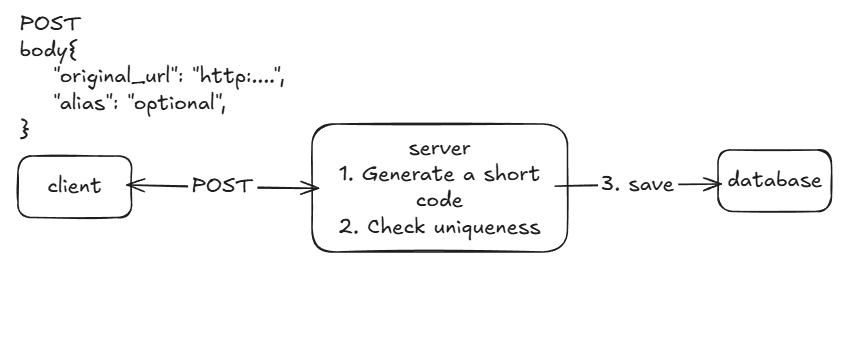
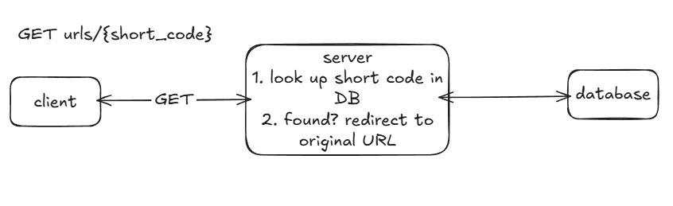

# URL Shotener

## Overview
Design an url shortening service that can convert long URLs to shorter urls (eg. tinyurl.com, bitly.com, ...)

> Example: https://www.domain.com/service/payment/checkout?id=12345 -> https://tiny.ly/Ab3kX

<div style="margin-left:3rem">
    
    
</div>

---

## Architecture Summary
<div style="margin-left:3rem">
    
</div>

---

## 1. Requirements

### Functional Requirements
1. Users should be able to create a **shortened URL** from a **long URL**.
2. Users should be able to access the **original long URL** by using the **shortened URL**.

### Non-Functional Requirements
1. **Latency** — system should be **low latency** on redirects
2. **Scalability** — support 100M DAU 1B shortened URLs
3. **High availability** — system should be **highly available**, prioritizing availability over consistency
4. **Uniqueness** — system should ensure the uniqueness of short codes(each shortened URL must map to exactly one long URL)

### Capacity Estimation
- estimating...

---

## 2. Core Entities

| Entity | Fields |
|--------|--------|
| **URL** | `original_url` (string), `short_url` (string), `user` (int) |

---

## 3. API Design

### Write — Shorten a URL
```
POST /urls
Body: { 
    "original_url": "https://www.domain.com/service/payment/checkout?id=12345",
    "custom_alias": "optional",
    "expiration": "optional"
}
Response
{
    "short_url": "https://tiny.ly/Ab3kX"
}
```

### Read — Redirects to Original URL
```
GET /urls/{short_code}
Response: Redirects to Original URL
```
> Called when a user actually **clicks** a suggestion, not on every keystroke.

---

## 4. Data Flow[Optional] + High Level Design

### A. Data Flow

#### i. WRITE flow
<div style="margin-left:3rem">
    
</div>

#### ii. READ flow
<div style="margin-left:3rem">
    
</div>

---

## 5. Deep Dives

### How to generate a short code for original long URL?

#### Approach 1: Random short code generator (simple but not optimal at scale)
- Given a range of char from a-z, A-Z and 0-9, we have total 62 chars. Pick random ~6-8 chars from it to create a short code.
- Pros: Easy to implement, satisfies 1B shortened URL [**Scalability (1B URLs)**](#non-functional-requirements).
- Cons: Must check uniqueness on every generation by querying the DB — increases latency and load under high traffic.

#### Approach 2: 

### How can we ensure that users are redirected fast (<200ms) at scale?
#### Approach 1: Database Indexing - (good but not optimal)
- We can create indexes on table to avoid scanning full table every look up.
- Pros: Easy, Built-in feature in database.
- Cons: Still hit database every lookup, not optimal for frequent access URLs.

#### Approach 2: Implementing Local Cache (in-process cache) - (good but not optimal)
- We can cache hot use URLs locally inside the servers
- Pros: Easy to implement, extremly fast (data lives in RAM)
- Cons: Server increases memory usage for storing additional cached data(expensive at scale, even with LRU eviction), inconsistent across servers(each server has its own cache and may have different data)

#### Approach 3: Implementing a distributed In-memory Cache (Redis, Memcached,...) (great, recommended solution)
- We can add a distributed in-memory cache like Redis between the server and database with **cache-aside** caching strategy.
- Pros: Extremely fast, perfect for high-read volume(Redis can handle 100k+ reads per sec)
- Cons: Introduce a **single point of failure** because If Redis goes down, all traffic falls back to database.
> Solution: Redis Sentinel or Redis Cluster

### Fault Tolerance
- **Servers go down?** → Load balancer routes to healthy servers
- **Distributed cache(Redis,...) goes down?** → Redis Cluster (automatic failover + horizontal scaling). Worst case the entire Redis cluster is down, fallback to PostgreSQL


---

# Resrouces


---
