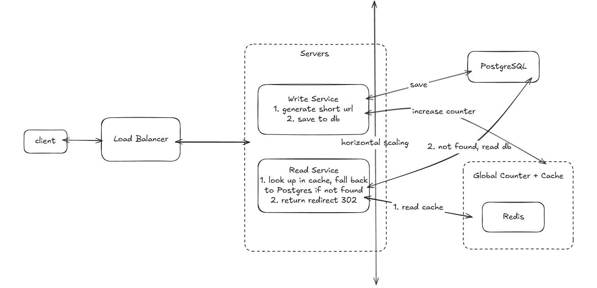

# URL Shotener

## Overview
Design an url shortening service that can convert long URLs to shorter urls (eg. tinyurl.com, bitly.com, ...)

> Example: https://www.domain.com/service/payment/checkout?id=12345 -> https://bitly.com/Ab3kX

## Demo UI
<div style="margin-left:3rem">
    
</div>

---

## Architecture Summary
<div style="margin-left:3rem">
    
</div>

---

## 1. Requirements

### Functional Requirements
1. Users should be able to create a **shortened URL** from a **long URL**.
2. Users should be able to access the **original long URL** by using the **shortened URL**.

### Non-Functional Requirements
1. **Latency**: system should be **low latency** on redirects
2. **Scalability**: support 100M DAU and store 1B shortened URLs
3. **High availability**: system should be **highly available**, prioritizing availability over consistency
4. **Uniqueness**: system should ensure the uniqueness of short codes(each shortened URL must map to exactly one long URL)

### Capacity Estimation
**Assumptions**
- 100M DAU
- 1 write (shorten) per user per day
- 100 reads (redirects) per write
> even distribution for easy estimation — in practice, some URLs go viral and receive significantly more traffic while others are rarely accessed.

**Traffic**
- Writes: 100M / 86,400 ≈ **1,200 writes/sec**
- Reads: 1,200 × 100 ≈ **120,000 reads/sec**
- Read/write ratio: **100:1** (read-heavy)

**Storage**
- ~500 bytes per URL record
- 1B URLs × 500 bytes ≈ **500GB** total storage

---

## 2. Core Entities

| Entity | Fields |
|--------|--------|
| **URL** | `original` (string), `short_code` (string), `user` (int) |

---

## 3. API Design

### Write — Shorten a URL
```
POST /urls
Body: { 
    "original_url": "https://www.domain.com/service/payment/checkout?id=12345",
    "custom_alias": "optional",
    "expiration": "optional"
}
Response
{
    "short_url": " https://bitly.com/Ab3kX"
}
```

### Read — Redirects to Original URL
```
GET /{short_url}
Response: Redirects to Original URL
```

---

## 4. Data Flow[Optional] + High Level Design

### A. Data Flow

#### i. WRITE flow
<div style="margin-left:3rem">
    
</div>

#### ii. READ flow
<div style="margin-left:3rem">
    
</div>

---

## 5. Deep Dives

### How to generate a short code for original long URL?

#### Approach 1: Random short code generator (simple but not optimal at scale)
- Given a range of char from a-z, A-Z and 0-9, we have total 62 chars. Pick random ~6-8 chars from it to create a short code.
- Pros: Easy to implement, satisfies 1B shortened URL [**Scalability requirement**](#non-functional-requirements).
- Cons: Must check uniqueness on every generation by querying the DB — increases latency and load under high traffic.

#### Approach 2: Global counter + Base 62 encoding
- Leverage Redis `INCR` as a **Global Atomic Counter** (this works similar to auto-increment in any SQL database), encode the counter value using Base62 to generate a short code.
- Pros: No collision checks needed, fast, no extra DB lookup on every write. Satisfies [**Scalability requirement**](#non-functional-requirements).
- Cons: Sequential codes are predictable(security problem). Redis is a single point of failure for writes.
> Solution: Redis AOF persistence for counter durability. Fallback to PostgreSQL sequence if Redis is down.

### How can we ensure that users are redirected fast (<200ms) at scale?
#### Approach 1: Database Indexing - (good but not optimal)
- We can create indexes on table to avoid scanning full table every look up.
- Pros: Easy, Built-in feature in database.
- Cons: Still hit database every lookup, not optimal for frequent access URLs.

#### Approach 2: Implementing Local Cache (in-process cache) - (good but not optimal)
- We can cache hot use URLs locally inside the servers
- Pros: Easy to implement, extremly fast (data lives in RAM)
- Cons: Server increases memory usage for storing additional cached data(expensive at scale, even with LRU eviction), inconsistent across servers(each server has its own cache and may have different data)

#### Approach 3: Implementing a distributed In-memory Cache (Redis, Memcached,...) (great, recommended solution)
- We can add a distributed in-memory cache like Redis between the server and database with **cache-aside** caching strategy.
- Pros: Extremely fast, perfect for high-read volume(Redis can handle 100k+ reads per sec)
- Cons: Introduces a **single point of failure** because If Redis goes down, all traffic falls back to database.
> Solution: Redis Sentinel or Redis Cluster
> Note: Can combine Approach 2 and 3 to handle extreme hot keys.

### Fault Tolerance
- **Primary servers go down?** → Load balancer routes to healthy servers
- **Distributed cache(Redis,...) goes down?** → Redis Cluster (automatic failover + horizontal scaling). Worst case the entire Redis cluster is down, fallback to PostgreSQL
- **Database goes down?** → PostgreSQL replication (primary + read replicas). Promote replica to primary on failure.
- **Traffic spike (thundering herd)?** → Rate limiting + auto-scaling servers horizontally.

---

### Future Improvements
- **Analytics dashboard**: visualize click stats, referrers, geographic data
- **User accounts**: allow users to manage and view their own shortened URLs
- **Custom domains**: allow users to use their own domain (e.g. `go.company.com`)
- **QR code generation**: generate QR code for each short URL
- **API keys / auth**: rate limit and track usage per user
- **Link preview**: show destination URL before redirecting
- **Multi-region deployment**: deploy closer to users for lower latency
---
