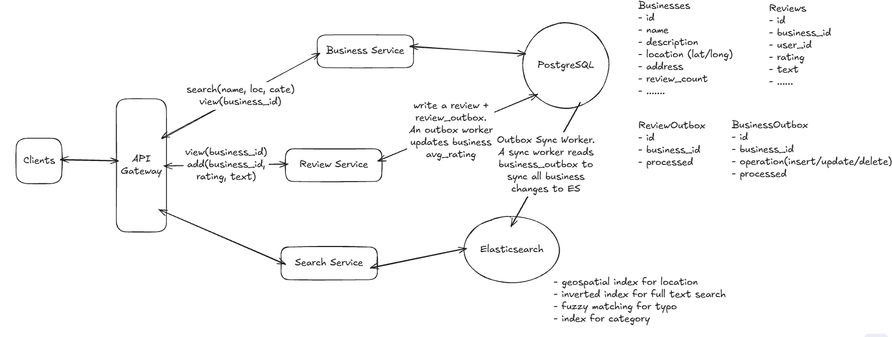

# Yelp Design

## Overview

Design a Yelp-like platform that enables users to discover local businesses, search for restaurants and services, write reviews, and view business ratings at scale.

> Yelp is a location-based business discovery platform where users can search for nearby businesses, read reviews, leave ratings, and share their experiences. This project explores the backend architecture behind building such a system using microservices, asynchronous messaging, distributed search and caching.

---

## Architecture Summary


## Architecture Summary

<div style="margin-left:3rem">
    
</div>

---

## 1. Requirements
### Functional Requirements
1. Users should be able to search for businesses by name, location, and category
2. Users should be able view businesses (detail + reviews)
3. User should be able to leave reviews + rating on businesses
4. Authenticated users can leave one review and one rating per business

### Non-Functional Requirements
1. **Latency** — low latency for search operations (< 500ms)
2. **Scalability** — support 100M DAU, 10M bussinesses
3. **High availability** — system should be highly available, prioritizing availability over consistency

### Capacity Estimation
**Assumptions**
- 100M DAU, 10M businesses
- Each user performs ~3 searches/day
- Users mostly search/view business, but rarely leave reviews -> Read/write ratio: **1000:1** (read-heavy)

**Traffic**
- Read: 100M DAU x 3 searchs/user/day = ~3472 QPS on average
- Write: 3472 / 1000 = ~3 WPS one average 


---

## 2. Core Entities

| Entity | Fields |
|---------|--------|
| **User** | `id`, `name`, `email` |
| **Business** | `id`, `name`, `description`, `address`, `latitude`, `longitude`, `category_id`, `rating` |
| **Review** | `id`, `user_id`, `business_id`, `rating`, `content` |
| **Category** | `id`, `name` |

---

# 3. API Design

### Read — Search for businesses
```
GET /bussinesses/search?q={query}&lat={latitude}&lng={longitude}&radius={km}
Response
{
    "businesses": []
}
```

## Read - View a business details and reviews
- 2 seperate endpoints for better independent pagination and scaling for reviews
```
GET /businesses/:businessId
Response
{
    "id": "123",
    "name": "Joe's Pizza",
    "address": "123 Main St",
    "rating": 4.5, 
    ...
}
GET /businesses/:businessId/reviews?page={pageNumber}&limit={pageSize}
Response
{
    "reviews": [
{
    "id": "456",
    "user_id": "789",
    "rating": 5,
    "content": "Great food!"
    },
    ...
    ],
    "page": 1,
    "limit": 20
    }
```

## Write - Leave a review
POST /businesses/:businessId/reviews
Body: { 
    "rating": 5,
    "content": "great food"
}

---

# 4. High Level Design


---

# 5. Deep Dives

## How to improve search to handle complex queries more efficiently?
- To search for businesses in database by name, lat and long, the query looks like
> SELECT *
> FROM businesses
> WHERE latitude > 10 AND latitude < 20
> AND longitude > 10 AND longitude < 20
> AND name LIKE '%coffee%';
- This is supper slow because of full scan table to meet conditions.

### Approach 1: Indexing on Lat/Long
- Pros: Simple
- Cons: not optimized for querying 2-dimensional data

### Approach 2: Using PostgreSQL extension: PostGIS (a spatial database) and pg_trgm (full text search)
- PostGIS: turns relational database into a powerful spatial database, allowing you to store, index, and query geographic and location-based data
- Pros: consistent data (all in Postgres)
- cons: thinking ...

- pg_trgm: replace the LIKE feature
- Pros: Fast
- cons: not perform as well as Elasticsearch for full-text search at very large scales
---

### Approach 3: Using Elasticsearch

- Pros: great at scale, 
- Cons: Inconsistency between ES and primary DB -> Change Data Capture (CDC) or Outbox Pattern

## How to efficiently calculate and update the average rating for businesses to ensure it's readily available in search results?

### Approach 1: Calculate the average when we need (Bad solution)
- Simply create a query that joins businesses and reviews table.
- Pros: Simple, no extra infra cost.
- Cons: JOIN sql becomes bottleneck, unnecessary recalculation, slowdown other read operations in db.

### Approach 2: Periodical update with worker
- add new avg_rating column on business -> worker precomputates avg_rating every 1h, 1d, etc -> update avg_rating.
- Pros: avg_rating comes with bussiness on query.
- Cons: not real time, unnecessary computation.

### Approach 3: Outbox pattern
- Outbox Pattern is a technique to reliably update your database and publish an event when you can't put both operations into the same transaction.
- Since we have 2 seperate databases **businesses** and **reviews** and can't atomically create a review and update business average rating in a transaction -> Outbox Pattern provides eventual consistency betwwen them.

- Workflow: 
+ User posts a review → review-service saves + inserts a row into review_outbox(processed=false) in the same transaction -> API responds instantly.
+ A worker polls every 5s → finds unprocessed rows, recalculates the business's average rating, sends it to listings-service via HTTP listings-service updates the rating, worker marks row processed → done, business now shows the new rating.

- Pros: high reliability(review + outbox event are commited atomically, workers process later)
- Cons: Eventual Consistency(brief stale-rating window), extra complexity(outbox + worker)


# Resources
